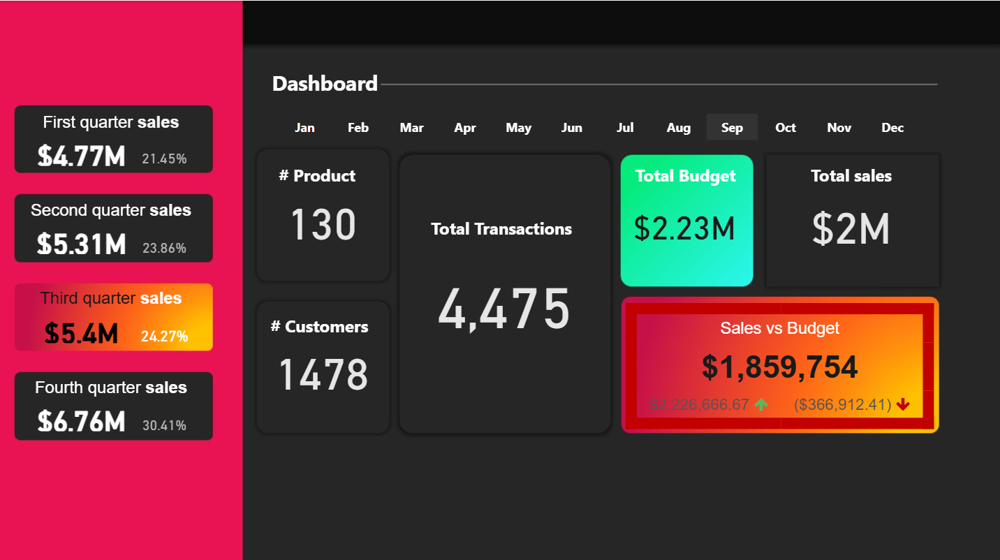

# # Sales-Performance-Analytics-Dashboard | Power BI Project

## Overview
This project is an interactive Sales Dashboard built using Power BI to analyze sales performance, customers, products, and geographical distribution.

The dashboard helps transform raw sales data into actionable insights that support data-driven decision-making.

---
## 📊 Dashboard



# Project Objectives
- Analyze overall sales performance
- Track customer and product metrics
- Monitor quarterly sales trends
- Identify top-performing customers and products
- Analyze sales by geographical locations
- Build interactive and dynamic dashboards

---

# Tools & Technologies
- Power BI
- DAX (Data Analysis Expressions)
- Data Modeling
- Star Schema
- Time Intelligence

---

# Data Model
The project follows a **Star Schema** design:

## Fact Table
### FactTable
Contains transactional sales data:
- Sales Amount
- Product Key
- Customer Key
- Order Dates

---

## Dimension Tables
### Dim_customer
Contains customer information.

### Dim_products
Contains product information.

### Calendar Table
Custom date table created using DAX for time-based analysis.

---

# Key DAX Measures

## Total Sales
```DAX
Total sales = SUM(FactTable[SalesAmount])
